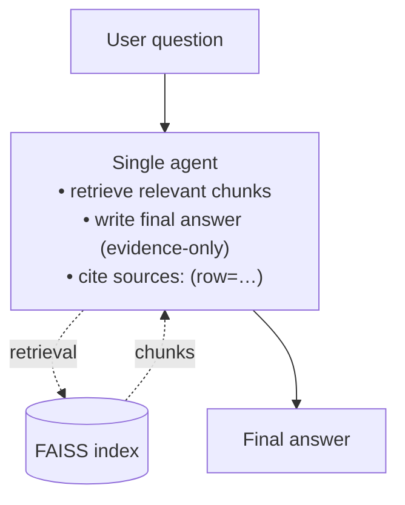
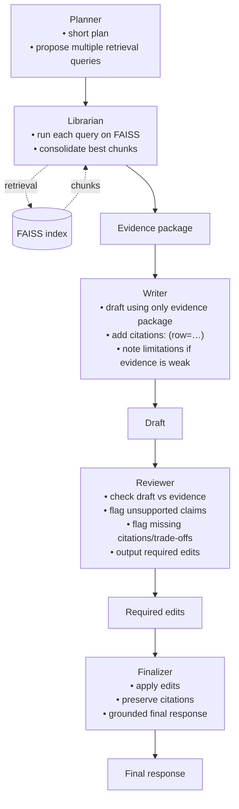

## Single Agent

```mermaid
flowchart TD
  U["User question"] --> A["Single agent<br/>• retrieve relevant chunks<br/>• write final answer (evidence-only)<br/>• cite sources: (row=…)"]

  A -. "retrieval" .-> IDX[("FAISS index")]
  IDX -. "chunks" .-> A

  A --> OUT["Final answer"]
```

## Multi Agent

```mermaid
flowchart TD
  P["Planner<br/>• short plan<br/>• propose multiple retrieval queries"] --> L["Librarian<br/>• run each query on FAISS<br/>• consolidate best chunks"]

  L -. "retrieval" .-> IDX[("FAISS index")]
  IDX -. "chunks" .-> L

  L --> EP["Evidence package"]
  EP --> W["Writer<br/>• draft using only evidence package<br/>• add citations: (row=…)<br/>• note limitations if evidence is weak"]

  W --> DRAFT["Draft"]
  DRAFT --> R["Reviewer<br/>• check draft vs evidence<br/>• flag unsupported claims<br/>• flag missing citations/trade-offs<br/>• output required edits"]

  R --> EDITS["Required edits"]
  EDITS --> F["Finalizer<br/>• apply edits<br/>• preserve citations<br/>• grounded final response"]

  F --> OUT["Final response"]
```
